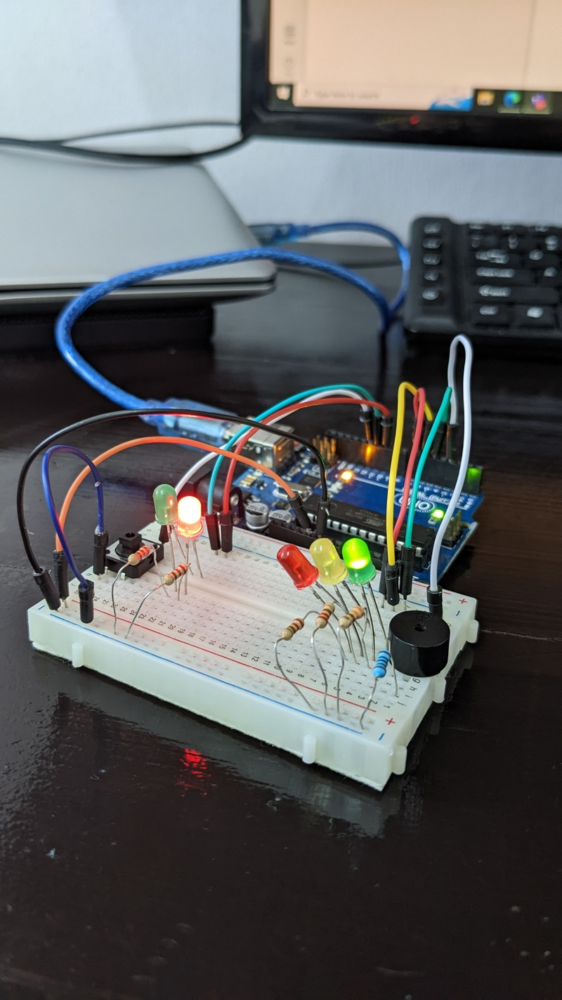
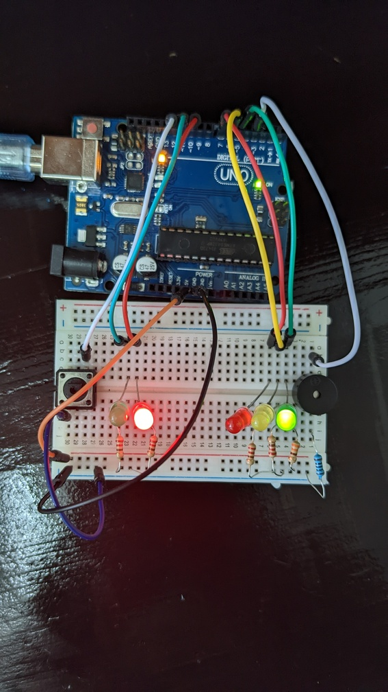
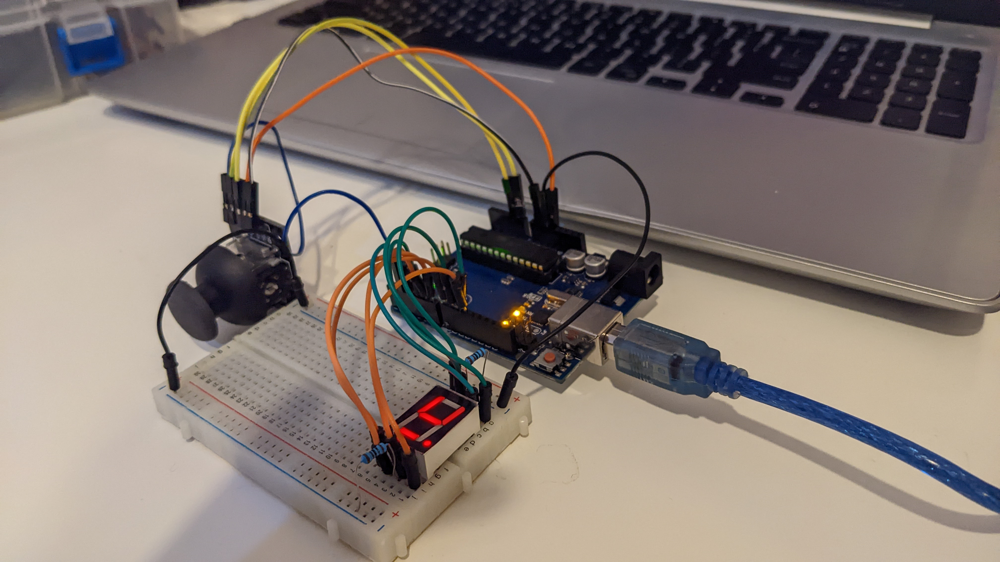
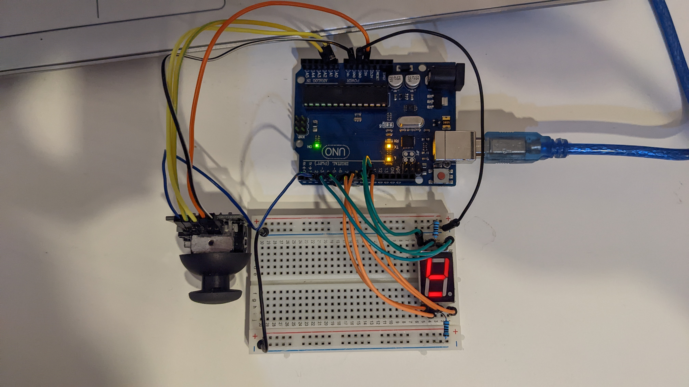
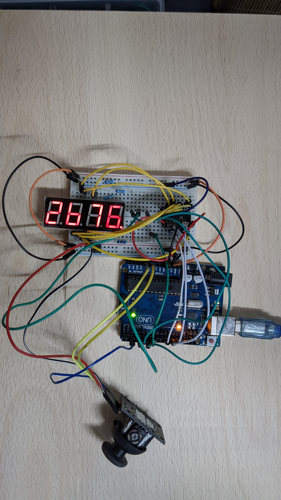

# IntroductionToRobotics

## Homework 0
  create the repository
  
## Homework 1
  As was described in the laboratory, the homework consists of the following:
  **• Components:** RBG  LED  (1  minimum),  potentiometers  (3  minimum),resistors and wires (per logic)  
  **• Technical Task:** Use a separat potentiometer in controlling each of thecolor of the RGB led (Red,Green andBlue).  The control must be donewithdigital electronics(aka you must read the value of the potentiome-ter with Arduino, and write a mapped value to each of the pins connectedto the led.  
  **• Publishing task:** You must add the code to the Git repo and continueupdating the readme with at least the following details (but feel free tobe more creative):
  1.  Task Requirements
  2.  Pictures of the setup    
    
   
  3.  Link to video showcasing functionality  
   [Youtube video](https://youtu.be/BsDxWu4RSrA "")
  4.  Remember to publish the video in the correct orientation. 
  5.  Hand in the homework on MS teams when done - aka whengit is up to date  
  <!-- -->
  **• Coding task:** Coding style is of utmost importance.  You must have aperfectly clean code in order to receive the maximum grade.  Keep in mindthat magic numbers are not accepted, although you might see them in thelab (as a trade-off for speed).  Remember to be consistent in your style,check  the  style  guide  and  the  provided  style  document  and  use  correctspacing. 
  
## Homework 2
  As was described in the course, the homework consists of the following:  
  **•Components:**  5 LEDs, 1 button, 1 buzzer, resistors and wires (per logic)  
  **•General  description:** Building  the  traffic  lights  for  a  crosswalk.   Youwill use 2 LEDs to represent the traffic lights for people (red and green)and 3 LEDs to represent the traffic lights for cars (red, yellow and green).See the states it needs to go through.  If anything is not clear, ask.  Also,see the uploaded video (the intervals are different, but the states flow isthe same).  It’s a traffic lights system for people and cars - don’t overthink it.  
  **The system has the following states:**  
  1.  **State 1**(default, reinstated after state 4 ends):  green light for cars,red  light  for  people,  no  sounds.   Duration:  indefinite,  changed  bypressing the button.  
  2.  **State 2**(initiated by counting down 8 seconds after a button press):the  light  should  be  yellow  for  cars,  red  for  people  and  no  sounds.Duration:  3 seconds.  
  3.  **State 3**(initiated after state 2 ends):  red for cars, green for peopleand a beeping sound from the buzzer at a constant interval. Duration:8 seconds.  
  4.  **State 4**(initiated after state 3 ends):  red for cars,blinking greenfor people and a beeping sound from the buzzer,  at a constant in-terval,  faster than the beeping in state 3.  This state should last 4seconds.  
    <!-- -->  
    
  Be  careful:  pressing  the  button  in  any  state  other  than  state  1  should NOT yield any actions.  
  **•Publishing task:** You must add the code to the Github repo and continue updating the readme with at least the following details (but feel free tobe more creative).  
  1.  Task Requirements  
  2.  Pictures of the setup  
     
    
  3.  Link to video showcasing functionality  
     [Youtube video](https://youtu.be/eCSHjbwQlj0 "")
  4.  Remember to publish the video in the correct orientation.  
  5.Hand in the homework on MS teams when done - aka whenGit is up to date
  <!-- -->
  
 ## Homework 3  
  As was described in the course, the homework consists of the following:
  **•Components:**  1  7-segment  display,  1  joystick,  resistors  and  wires  (perlogic)  
  **•General description:** You will use the joystick to control the position ofthe segment and ”draw” on the display.  The movement between segmentsshould be natural (meaning they should jump from the current positiononly to neighbors, but without passing through ”walls”.  
  **The system has the following states:**  
  **1.State  1**(default,  but  also  initiated  after  a  button  press  in  State2):  Current  position  blinking.   Can  use  the  joystick  to  move  fromone  position  to  neighbors.   Short  pressing  the  button  toggles  state2.  Long pressing the button in state 1 resets the entire display byturning all the segments OFF and moving the current position to thedecimal point.  
  **2.State  2**(initiated  after  a  button  press  in  State  1):   The  currentsegment  stops  blinking,  adopting  the  state  of  the  segment  beforeselection (ON or OFF). Toggling the X (or Y, you chose) axis shouldchange  the  segment  state  from  ON  to  OFF  or  from  OFF  to  ON. Clicking the joystick should save the segment state and exit back tostate 1.
  **•Publishing task:** You must add the code to the Github repo and continue updating the readme with at least the following details (but feel free tobe more creative).  
  1.  Task Requirements  
  2.  Pictures of the setup  
     
    
  3.  Link to video showcasing functionality  
     [Youtube video](https://youtu.be/Zrn_YXax0Jc "")
  4.  Remember to publish the video in the correct orientation.  
  5.Hand in the homework on MS teams when done - aka whenGit is up to date
  <!-- -->
  
  ## Homework 4
   Basic requirements:
**• Components:** a joystick, a 4 digit 7-segment display, a 74hc595 shift
register  
**• General Description:** Use the joystick to move through the 4 digit 7
segment displays digits, press the button to lock in on the current digit
and use the other axis to increment or decrement the number. Keep the
button pressed to reset all the digit values and the current position to the
first digit in the first state.  
The system has the following states:  
**1. First state:** you can use a joystick axis to cycle through the 4 digits;
using the other axis does nothing. A blinking decimal point shows
the current digit position. When pressing the button, you lock in on
the selected digit and enter the second state.  
**2. Second state:** in this state, the decimal point stays always on, no
longer blinking and you can no longer use the axis to cycle through
the 4 digits. Instead, using the other axis, you can increment on
decrement the number on the current digit IN HEX (aka from 0
to F, as in the lab). Pressing the button again returns you to the
previous state. Also, keep in mind that when changing the number,
you must increment it for each joystick movement - it should not
work continuosly increment if you keep the joystick in one position
(aka with joyMoved).  
**3. Reset:** toggled by long pressing the button only in the first state.
When resetting, all the digits go back to 0 and the current position
is set to the first (rightmost) digit, in the first state.  
• Publishing task: You must add the code to the Github repo and continue
updating the readme with at least the following details:  
1. Task Requirements
2. Picture of the setup  
  
3. Link to video showcasing functionality 
[Youtube video](https://www.youtube.com/shorts/py17s0I5fGs "")

## Homework 5
LCD menu + mini game  
Photos:  
  
  
  

Video: [Youtube video](https://youtube.com/shorts/KtHuDofR_Xg "")

