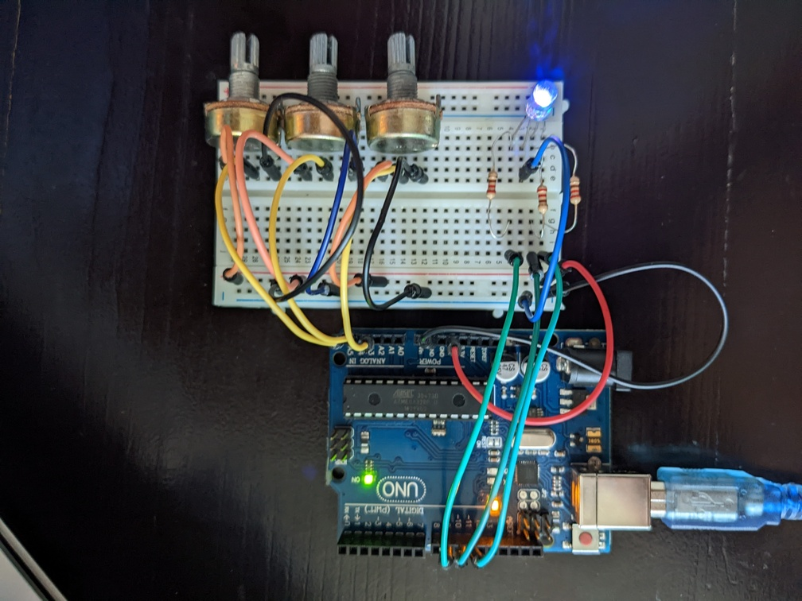
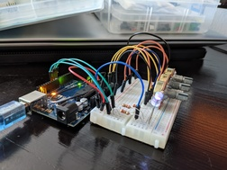

# IntroductionToRobotics

## Homework 0
  create the repository
  
## Homework 1
  As was described in the laboratory, the homework consists of the following:
  **• Components:** RBG  LED  (1  minimum),  potentiometers  (3  minimum),resistors and wires (per logic)  
  **• Technical Task:** Use a separat potentiometer in controlling each of thecolor of the RGB led (Red,Green andBlue).  The control must be donewithdigital electronics(aka you must read the value of the potentiome-ter with Arduino, and write a mapped value to each of the pins connectedto the led.  
  **• Publishing task:** You must add the code to the Git repo and continueupdating the readme with at least the following details (but feel free tobe more creative):
  1.  Task Requirements
  2.  Pictures of the setup
    
   
  4.  Link to video showcasing functionality  
   [Youtube video](https://youtu.be/BsDxWu4RSrA "Youtube video")
  5.  Remember to publish the video in the correct orientation. 
  6.  Hand in the homework on MS teams when done - aka whengit is up to date  
  <!-- -->
  **• Coding task:** Coding style is of utmost importance.  You must have aperfectly clean code in order to receive the maximum grade.  Keep in mindthat magic numbers are not accepted, although you might see them in thelab (as a trade-off for speed).  Remember to be consistent in your style,check  the  style  guide  and  the  provided  style  document  and  use  correctspacing. 
